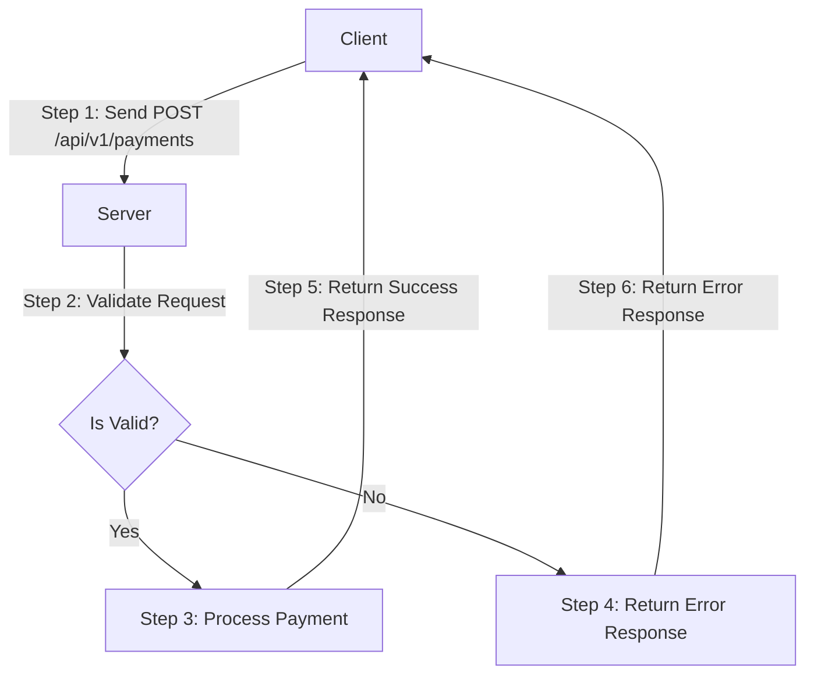
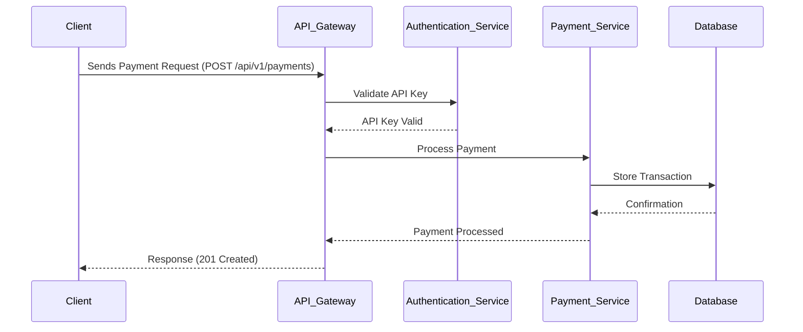
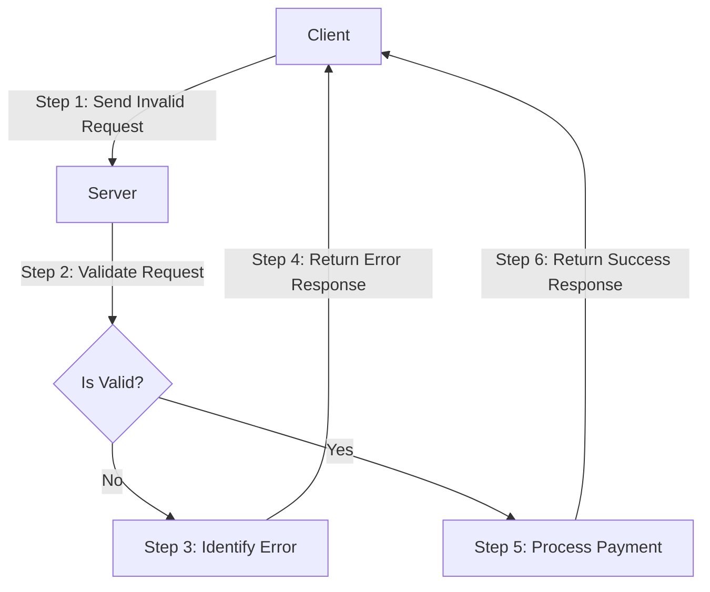

# API Documentation: Cross-Border Payment Endpoint

## Overview
The `POST /api/v1/payments` endpoint is used to initiate a cross-border payment transactions between a sender and a recipient. This API allows users to transfer funds internationally by specifying the sender's and recipient's details, the amount, currency, and a unique reference ID for the transaction. The API returns a transaction ID upon success.

---

## API Flow Diagram
This diagram illustrates the simplified flow of a cross-border payment transaction.



### Explanation:
- **Client**: The user or application making the API request.
- **Server**: The backend system processing the request.
- **Validate Request**: Checks if the request is valid (e.g., correct headers, body parameters).
- **Process Payment**: Executes the payment logic.
- **Return Success/Error Response**: Sends the appropriate response back to the client.

---

## API Request
### API Request Sequence

This diagram illustrates the sequence of a request through the API.


#### Explanation of the Payment API Sequence Diagram

- **Client**: The client initiates the payment process by sending a POST request to the `/api/v1/payments` endpoint.
- **API Gateway**: The API Gateway receives the request and forwards it to the Authentication Service to validate the API key.
- **Authentication Service**: The Authentication Service checks if the API key is valid. If valid, it confirms the authentication to the API Gateway.
- **Payment Service**: Once the API key is validated, the API Gateway forwards the payment request to the Payment Service. The Payment Service processes the payment and interacts with the Database to store the transaction details.
- **Database**: The Database stores the transaction and sends a confirmation back to the Payment Service.
- **Response**: The Payment Service confirms to the API Gateway that the payment has been processed. The API Gateway sends a `201 Created` response back to the Client, indicating that the payment was successful.

### HTTP API Request Method
- **POST** `/api/v1/payments`

### Headers

| Header Name       | Description                                                                |
|-------------------|----------------------------------------------------------------------------|
| `Authorization`   | Bearer token for authentication.       Format: `Bearer <your_api_key>`.    |
| `Content-Type`    | Specifies the format of the request body, must be   `application/json`.    |

### Body Parameters
The API request body must be in JSON format and include the following fields:

| Field                      | Type     | Description                                                                |
|----------------------------|----------|----------------------------------------------------------------------------|
| `amount`                   | `number` | The amount to be transferred, must be a positive number.                   |
| `currency`                 | `string` | Currency code for the transaction (e.g., `USD`).                           |
| `sender`                   | `object` | Details of the sender.                                                     |
| `sender.name`              | `string` | Full name of the sender.                                                   |
| `sender.email`             | `string` | Email address of the sender.                                               |
| `recipient`                | `object` | Details of the recipient.                                                  |
| `recipient.name`           | `string` | Full name of the recipient.                                                |
| `recipient.accountNumber`  | `string` | Recipient's bank account number.                                           |
| `recipient.bankCode`       | `string` | Bank code of the recipient's bank.                                         |
| `recipient.country`        | `string` | Country code of the recipient (e.g., `USA`).                               |
| `reference`                | `string` | A unique reference for the transaction (e.g., invoice number).             |

#### Example: API Request Body
```json
{
  "amount": 100.00,
  "currency": "USD",
  "sender": {
    "name": "John Doe",
    "email": "john.doe@x.com"
  },
  "recipient": {
    "name": "Jane Smith",
    "accountNumber": "0987654321",
    "bankCode": "XYZ456",
    "country": "USA"
  },
  "reference": "INV-12345"
}
```

---

## API Response
- **Success Response (HTTP 201)**

### Body Parameters
The response body will be in JSON format. A successful API request will return a `201 Created` status code with the following response body:

| Field                | Type     | Description                                                         |
|----------------------|----------|---------------------------------------------------------------------|
| `transactionId`      | `string` | Unique identifier for the transaction.                              |
| `status`             | `string` | Status of the transaction (e.g., `SUCCESS`).                        |
| `createdAt`          | `string` | Timestamp of when the transaction was created in `ISO 8601 format`. |
| `amount`             | `number` | The amount transferred, must be a positive number.                  |
| `currency`           | `string` | The currency code for the transaction.                              |
| `recipient`          | `object` | Details of the recipient.                                           |
| `recipient.name`     | `string` | Full name of the recipient.                                         |
| `recipient.country`  | `string` | Country code of the recipient.                                      |

#### Example: API Success Response
```json
{
  "transactionId": "TXN789456123",
  "status": "SUCCESS",
  "createdAt": "2025-01-12T10:15:30Z",
  "amount": 100.00,
  "currency": "USD",
  "recipient": {
    "name": "Jane Smith",
    "country": "USA"
  }
}
```

---

## Error Responses 

When an API request fails due to invalid input or other issues, the API returns an error response with relevant status codes and messages. This helps clients handle errors appropriately.

### Error Format
The API error response has the following structure: 

| Field            | Type     | Description                                                                 |
|------------------|----------|-----------------------------------------------------------------------------|
| `error`          | `string` | Error code indicating the type of error (e.g., `INVALID_REQUEST`).          |
| `message`        | `string` | Human-readable message describing the error.                                |

#### Examples of API Error Responses
1. **400 - Invalid Request**
```json
{
 "error": "INVALID_REQUEST",
  "message": "Invalid bank code for the recipient."
}
```
2. **401 - Unauthorized**
```json
{
  "error": "UNAUTHORIZED",
  "message": "Invalid API key."
}
```
3.  **422 - Unprocessable Entity**
```json
{
  "error": "UNPROCESSABLE_ENTITY",
  "message": "Amount must be greater than zero."
}
```
4. **500 - Internal Server Error**
```json
{
  "error": "SERVER_ERROR",
  "message": "An unexpected error occurred. Please try again later."
}
```

---

## API Error Handling

### Error Handling Flow
This diagram illustrates how errors are handled in the API. 


#### Explanation:
- **Send Invalid Request**: The client sends a request with missing or incorrect data.
- **Identify Error**: The server identifies the type of error (e.g., invalid bank code, missing fields).
- **Return Error Response**: The server sends an error response (e.g., 400 Bad Request)

Below are common API error responses:

| HTTP Status Code   | Error Code             | Description                                                                         |
|--------------------|------------------------|-------------------------------------------------------------------------------------|
| `400`              | `INVALID_REQUEST`      | The request contains invalid data or parameters (e.g., invalid bank code).          |
| `401`              | `UNAUTHORIZED`         | The API key is missing or invalid.                                                  |
| `403`              | `FORBIDDEN`            | The user does not have permission to perform this action.                           |
| `422`              | `UNPROCESSABLE_ENTITY` | The request was well-formed but was unable to be followed due to semantic errors.   |
| `500`              | `INTERNAL_ERROR`       | An unexpected error occured on the server.                                          |


---

## Instance of Valid and Invalid Requests and the corresponding responses
- Valid API Request and Success Response

**API Request**
```bash
POST "/api/v1/payments"
Headers:
    "Authorization: Bearer <your_api_key>" 
    "Content-Type: application/json" 

Body:
{
 "amount": 100.00,
  "currency": "USD",
  "sender": {
    "name": "John Doe",
    "email": "john.doe@x.com"
  },
  "recipient": {
    "name": "Jane Smith",
    "accountNumber": "0987654321",
    "bankCode": "XYZ456",
    "country": "USA"
  },
  "reference": "INV-12345"
}
```
**Response**
```bash
HTTP/1.1 201 Created
{
  "transactionId": "TXN789456123",
  "status": "SUCCESS",
  "createdAt": "2025-01-12T10:15:30Z",
  "amount": 100.00,
  "currency": "USD",
  "recipient": {
    "name": "Jane Smith",
    "country": "USA"
  }
}
```

- Invalid API Request and Response

**Request**
```bash
POST "/api/v1/payments"
Headers:
    "Authorization: Bearer <your_api_key>" 
    "Content-Type: application/json" 

Body:
{
 "amount": 100.00,
  "currency": "USD",
  "sender": {
    "name": "John Doe",
    "email": "john.doe@x.com"
  },
  "recipient": {
    "name": "Jane Smith",
    "accountNumber": "0987654321",
    "bankCode": "NO_CODE",
    "country": "USA"
  },
  "reference": "INV-12345"
}
```
**Response**
```bash
HTTP/1.1 400 Bad Request
{
  "error": "INVALID_REQUEST",
  "message": "Invalid bank code for the recipient."
}
```
*Note: The invalid API request fails because the bank code "NO_CODE" is not recognized by the system, since it expects a string of numbers and letters. The system validates all input parameters and returns appropriate error messages if any required field is incorrect or missing.*

---

## Additional Notes
- Ensure the `Authorization` header contains a valid API key.
- The `reference` field should be unique for each transaction.
- The `description` field provides an optional description of the payment.
- For production use, always validate the response status before processing the data.

---

## Versioning
This API follows versioning format `v1`. Future updates will be available under `/api/v2/payments` or later versions.

---

## Contact
For API support, reach out to `support@mypaymentapi.com`.

---

## License
This API documentation is licensed under [MIT License](https://opensource.org/licenses/MIT).
